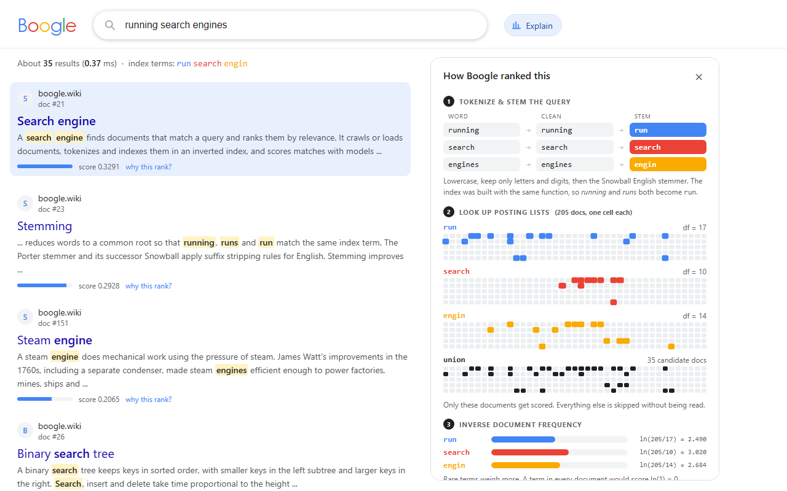
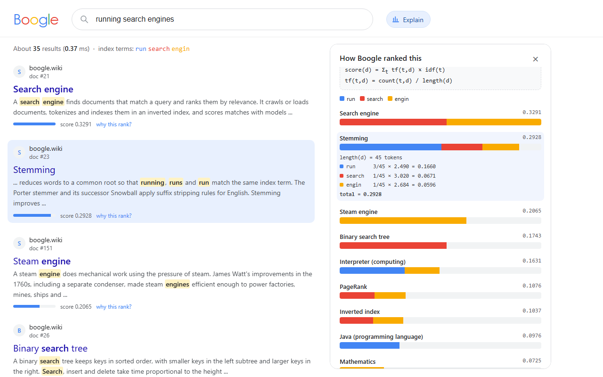
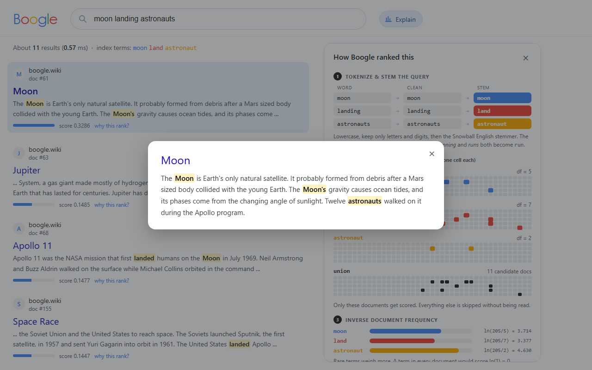
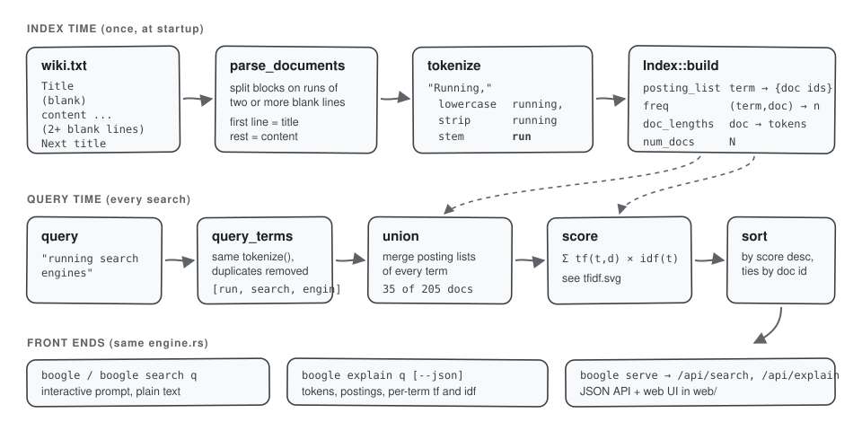
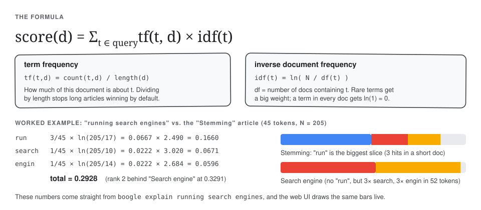

# boogle

**Live demo:** https://boogle-lovat.vercel.app

A tiny search engine in Rust: an in-memory inverted index, Snowball stemming and TF-IDF ranking, with a CLI, a JSON API and a web UI that shows exactly how each result was scored.


([demo.mp4](docs/media/demo.mp4) if you prefer video.)

## What it does

- Loads a corpus of articles from `wiki.txt` (205 short articles are included) and indexes them in a few milliseconds.
- Answers free-text queries. Words are lowercased, stripped of punctuation and stemmed, so `running` finds "runs" and "run".
- Ranks matches with TF-IDF and returns titles, highlighted snippets and scores.
- Explains every ranking: how the query was tokenized, which posting lists were hit, the IDF of each term and a per-document score breakdown. The same data is available from the CLI (`boogle explain`) and drawn as animated bars in the web UI.

| Home | Explain panel |
| --- | --- |
|  |  |
| **Score breakdown** | **Article view** |
|  |  |

## How it works



1. **Parsing.** `parse_documents` splits `wiki.txt` into articles. A run of two or more blank lines ends an article; the first line of each block is the title and the rest is the content.
2. **Tokenizing.** `tokenize` splits on whitespace, lowercases, keeps only letters and digits, and stems each word with the English Snowball stemmer (`rust-stemmers`). Words that are pure punctuation are dropped.
3. **Indexing.** `Index::build` walks every document once and fills three maps: `posting_list` (term to the sorted set of doc ids containing it), `freq` ((term, doc) to count) and `doc_lengths` (doc to token count).
4. **Searching.** The query goes through the same tokenizer, duplicate terms are removed, the posting lists of the remaining terms are merged into a candidate set, and only those candidates are scored.



The score is plain TF-IDF summed over the query terms. `tf` is the term count divided by the document length, so a short article that mentions a word three times beats a long one that mentions it three times. `idf = ln(N / df)` makes rare terms count for more; a term that appears in every document contributes nothing.

## Quick start

Requires Rust stable (edition 2024, so 1.85 or newer).

```bash
cargo build --release
cargo run --release -- serve          # http://localhost:8107
```

Open <http://localhost:8107>, search, and press **Explain** (or "why this rank?" under any result).

The CLI still works on its own:

```text
$ cargo run --release
indexed 205 docs, 2502 terms in 6.1 ms  (:explain <q> for details, :q to quit)
search> rust programming
0.273 -> Rust (programming language)
0.145 -> Python (programming language)
0.138 -> Compiler
0.134 -> Java (programming language)
0.133 -> Garbage collection
search> :q
```

```text
$ cargo run --release -- explain running search engines -n 1
tokenize:
  running          -> running        -> run
  search           -> search         -> search
  engines          -> engines        -> engin

terms (N = 205 docs):
  run          df=17   idf=ln(205/17)=2.490
  search       df=10   idf=ln(205/10)=3.020
  engin        df=14   idf=ln(205/14)=2.684

35 candidate docs; top 1:
  0.3291  Search engine  (len 52)
          search       tf=3/52=0.0577 x idf 3.020 = 0.1743
          engin        tf=3/52=0.0577 x idf 2.684 = 0.1548
```

All commands:

```text
boogle [OPTIONS]                      interactive prompt (default)
boogle search <query...> [--json]     print the top results once
boogle explain <query...> [--json]    show tokens, postings and score breakdown
boogle serve [--port 8107]            JSON API + web UI on http://localhost:<port>
boogle export <file.json> <query>...  write search+explain JSON for the offline web demo

--corpus <path>   corpus file (default: wiki.txt)
--limit <n>       only index the first n documents
-n <n>            number of results to show (default 5)
--web <dir>       static files for `serve` (default: web)
```

Run the tests with `cargo test`.

### HTTP API

| Endpoint | Returns |
| --- | --- |
| `GET /api/search?q=...&n=10` | `{query, terms, total, took_ms, results: [{id, title, snippet, score}]}`. `title` and `snippet` are lists of `{text, hit}` segments, so the client can highlight matches without re-implementing the stemmer. |
| `GET /api/explain?q=...&n=10` | `{steps, terms: [{term, df, idf, postings}], candidates, docs: [{title, length, score, parts: [{term, count, tf, idf, contrib}]}]}` |
| `GET /api/doc?id=3` | The full article. |
| `GET /api/stats` | Document, term, token and posting counts, plus index build time. |

### Offline demo

`web/demo.json` is generated by `boogle export` for the queries suggested on the home page. If the page cannot reach `/api`, for example when `web/` is served by a plain static server, it falls back to that file, so the suggested queries still work with real engine output. Regenerate it after changing the engine or the corpus:

```bash
cargo run --release -- export web/demo.json "rust programming" "running search engines" "big cats" \
  "moon landing astronauts" "vietnamese noodle soup" "quantum cryptography" "ancient pyramids egypt" \
  "jazz piano" "how do compilers work" "the"
```

## Corpus format

`wiki.txt` is plain UTF-8:

```text
Title One

Paragraph content for the first article, can span
multiple lines of the source file.


Title Two

Paragraph content for the second article.
```

The bundled corpus is 205 short encyclopedia-style summaries written for this project (computing, science, animals, food, places, history, music, sport, maths). Point `--corpus` at any file in the same format to search something else.

## Project layout

```text
src/engine.rs    parsing, tokenizer, inverted index, TF-IDF, snippet + explain builders
src/server.rs    `boogle serve`: tiny_http JSON API and static file server
src/main.rs      argument parsing, REPL, search/explain/export commands
web/             index.html, style.css, app.js (no build step), demo.json
wiki.txt         the sample corpus
docs/media/      demo recording, screenshots, diagrams
```

## Design notes

- **One engine, several front ends.** The CLI, the API and the offline export all call the same functions in `engine.rs`. The explain view is not a re-implementation in JavaScript; it renders what the Rust code computed.
- **Highlighting uses the stemmer.** Snippet words are marked when their stem is a query term, which is the same test the index uses. That is why "landed" lights up for the query "landing". The server sends segments rather than HTML, so there is no escaping to get wrong.
- **Snippets** are the 32-word window with the most query-term hits, found with a sliding count.
- **No persistence.** The index is rebuilt at startup. For 205 documents that takes a few milliseconds; for a much bigger corpus you would want to serialize it or use a compressed on-disk posting format.
- **Plain TF-IDF, OR semantics.** Any document with at least one query term is a candidate. There is no phrase matching, stop-word list or length saturation (BM25 would be the next step). Common words like "the" get an IDF close to zero rather than being removed.
- **tiny_http** keeps the server single-threaded and dependency-light. Requests are answered in well under a millisecond, so a thread pool would not buy anything here.

### Changes from the original version

- `main` indexed `documents[0..2000]`, which panicked on any corpus with fewer than 2000 articles. It now indexes everything; `--limit` restores the cap if you want it.
- Words that were only punctuation (a lone `-`) became an empty-string term. They are now dropped.
- Repeated query words were counted twice (`rust rust` doubled the score). Query terms are now de-duplicated.
- The REPL looped forever on EOF. Ctrl+D / Ctrl+Z or `:q` now exits, and empty lines are ignored.
- The stemmer was created on every `tokenize` call. It is now built once.
- A zero-length document no longer divides by zero, and ties in the ranking are broken by document id so output is stable.
